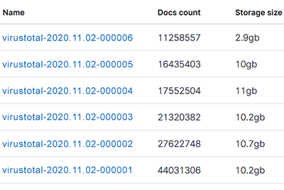
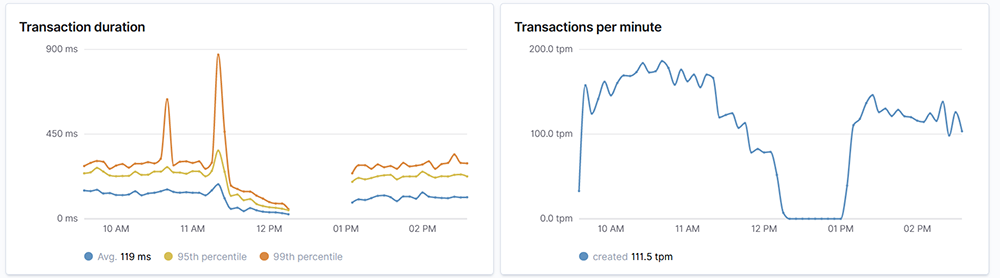
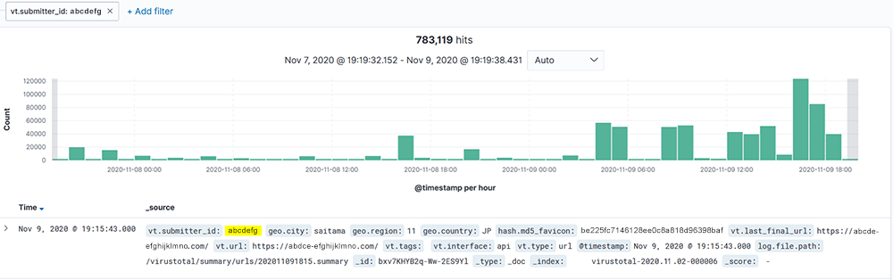
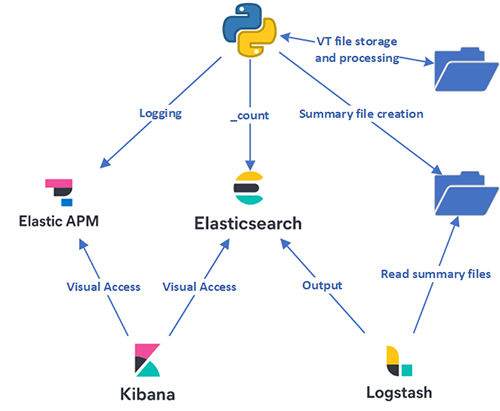

# Introduction
This project integrates the capabilities of the [VirusTotal feeds API](https://developers.virustotal.com/v3.0/reference#feeds), [ElasticSearch](https://www.elastic.co/elastic-stack), [Elastic APM](https://www.elastic.co/apm), and [Logstash](https://www.elastic.co/logstash). A Python script downloads files from the VirusTotal feeds API and saves them to disk. These files are post processed to create a small json object of notable values called a summary file which is then saved to disk. Logstash watches for the summary files, processes them, and outputs them into ElasticSearch. Elastic APM is used to monitor the transations per minute of the entire Python script as well as any errors.

The created summary files contain only a fraction of the information within the original VT feeds provided file. And an additional URL whitelist process (e.g. don't log certificate revocation urls) ensures the summary files are as small as possible. It contains notable values that you cannot search with using the VT web interface. The data is indexed by ElasticSearch making the search of the notable values extremely quick.

## Quick Start

1. Have an [ELK stack](https://www.elastic.co/what-is/elk-stack) and [Elastic APM](https://www.elastic.co/apm) configured and working

2. Edit the configuration at the top of the `vt-download.py` script.

3. Use the script `--setup-elasticsearch` to automatically create the ElasticSearch index template, the Index Lifecycle Management (ILM) policies, and bootstrap the created index. It will not overwrite existing policies/data. 

```console
$ vt-download.py --setup-elasticsearch True
INFO:Script started: 2020-11-02 09:02:06.231492
INFO:ElasticSearch index lifecycle policy not found. Creating ILM policy: virustotal
INFO:ElasticSearch index template not found. Creating index template: virustotal
INFO:ElasticSearch index not found. Creating index: virustotal-2020.11.02-000001
INFO:Script finished: 2020-11-02 09:03:05.298151
```

4. Add the Logstash configuration found in this repository and point it to the output folder configured in the `vt-download.py` Python script

5. Run `vt-download.py --download-feed urls --num-days-ago 7 --create-summaries True`

```console
$ vt-download.py --download-feed files --num-days-ago 7 --create-summaries True
INFO:Script started: 2020-11-03 05:47:55.071758
INFO:Starting from 7 days ago, there are 10081 filenames to process. First file 202010250547. Last file: 202011020547

INFO:Downloading using VirusTotal files feeds API
INFO:[create_summary] Creating summary file: /opt/virustotal/summary/urls/202011021013.summary
```
6. Check in Kibana to see index grow with documents



7. Check in Kibana APM to see the script's transactions



7. Create a Kibana index pattern for the index alias configured in `vt-download.py`

8. Search in Kibana (or ElasticSearch) for desired key value




## How it works

`--download-feed` and `--num-days-ago <1-7>`: The VT feeds API provides json-encoded data for files and urls analyzed by their platform. The feed generates a new file every one minute and provides access to the last seven days of files. The input to their API is the API key and a string in the format `YYYYMMDDhhmm`. This script uses Pandas to generate a list of dates and times that are in the required format. The list contains one file for every minute of the day. Every file listed is then downloaded from VT and stored on disk. Before the download occurs, the script checks if the file is already present on disk and if it is, it does NOT download it again.

`--create-summaries`: This processes the bz2 compressed files downloaded from the VT feeds API. The created summary files contain only a fraction of the information within the original VT feeds provided file. And an additional URL whitelist process (e.g. don't log certificate revocation urls) insures the summary files are as small as possible. Before a summary is created, it checks ElasticSearch for its presence. It does this with the [count API](https://www.elastic.co/guide/en/elasticsearch/reference/current/search-count.html) and if more than zero results are return, it will not create the summary file. The Python multiprocessing module is used to generate these summary files extremely quickly.

`--back-populate-summaries`: The script checks the disk for all bz2 compressed files downloaded from the VT feeds API. This could be 10s or 10,000s of files. It checks if a summary file already exists on disk. If it does not, then it follows the same logic as `--create-summaries`

`--setup-elasticsearch`: The script is pre-loaded with index templates that include mappings, the Index Lifecycle Management (ILM) policies, and bootstrap the created index. This must be ran first so that the rest of the script can function.

Logstash is used to read in all summary files and output them to Elasticsearch. The provided configuration reads the summary file then deletes it. Because the `--create-summaries` and `--back-populate-summaries` first checks the ElasticSearch for the presence of a summary file, there is no worry that Logstash will ever double process a summary file.

The following image outlines the data flows for the project.




## Script Help Output

```console
usage: vt-download.py [-h] [--download-feed {files,urls}]
                      [--num-days-ago <1-7>]
                      [--create-summaries [True or False]]
                      [--back-populate-summaries [{files,urls}]]
                      [--create-single-summary <File Path>]
                      [--setup-elasticsearch True or False]

Overview: Downloads files from VT feeds API and saves it to disk. If desired, creates a small summary file. Integrates with ElasticSearch and Elastic APM.

Configuration Requirement:
    Edit the top of this Python script to include the VT API key, Elasticsearch credentials, Elastic APM credentials, and output folder.

Examples:
    Download from VT the URL feed starting from 7 days ago and create summaries:
        vt-download.py --download-feed urls --num-days-ago 7 --create-summaries True

    Look across all previously downloaded URLS files on disk and create summaries for them:
        vt-download.py --back-populate-summaries urls

    Create a single summary file based on an input of a previously downloaded file:
        vt-download.py --create-summaries /opt/virustotal/urls/2020-11-28/202011280908

optional arguments:
  -h, --help            show this help message and exit

VirusTotal Feed Download and Processing Options:
  --download-feed {files,urls}
                        Pick the VT feed to download. For the number of days ago provided value, the script will first check if the file is already present. If so, it does NOT download it again and will continue and download the next file.
  --num-days-ago <1-7>  The number of days to start behind the current time. VT allows a max of 7 days.
  --create-summaries [True or False]
                        For each file just downloaded from VT, generate a summary file if that file is not present in the Elasticsearch index

Additional capabilities of this script:
  --back-populate-summaries [{files,urls}]
                        Finds all downloaded VT feed BZ2 files on disk and determines if there is a matching summary file in the Elasticsearch index. If it is not found in the Elasticsearch index, it generates a summary file.
  --create-single-summary <File Path>
                        Provide an absolute path to VT feed BZ2 file and it will generate a summary file.
  --setup-elasticsearch True or False
                        Creates ElasticSearch index template, the ILM policy, and bootstraps the index. Will not overwrite existing. Must run this before using the rest of the script.
```

## Requirements

Python Modules:
  * [Pandas](https://pypi.org/project/pandas/)
  * [elasticapm](https://pypi.org/project/elastic-apm/)
  * [Elasticsearch](https://pypi.org/project/elasticsearch7/)

Applications:
  * [Elasticsearch](https://www.elastic.co/elastic-stack) - Tested in 7.10.0
  * [Elastic APM](https://www.elastic.co/apm) - Tested in 7.10.0
  * [Kibana](https://www.elastic.co/kibana) - Tested in 7.10.0
  * [Logstash](https://www.elastic.co/logstash) - Tested in 7.10.0
  
Licenses:
  * [Elastic Stack Basic](https://www.elastic.co/subscriptions) license (it is free)
  * VirusTotal [Premium API](https://developers.virustotal.com/reference#public-vs-private-api) with access to feeds API (not free)
 
  
### License for this project
* agpl-3.0
